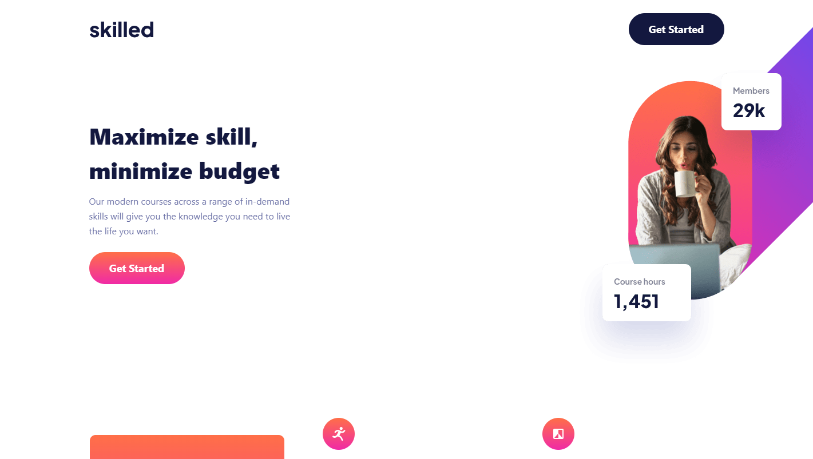
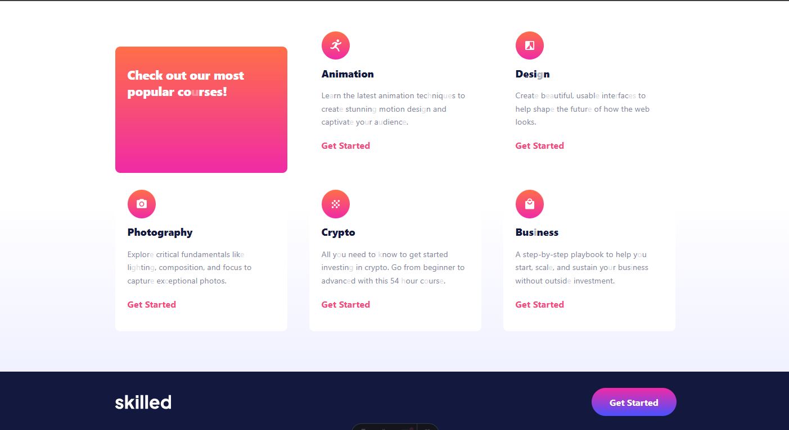

# Frontend Mentor - Skilled e-learning landing page solution

This is a solution to the [Skilled e-learning landing page challenge on Frontend Mentor](https://www.frontendmentor.io/challenges/skilled-elearning-landing-page-S1ObDrZ8q). Frontend Mentor challenges help you improve your coding skills by building realistic projects.

## Table of contents

- [Overview](#overview)
  - [The challenge](#the-challenge)
  - [Screenshot](#screenshot)
  - [Links](#links)
- [My process](#my-process)
  - [Built with](#built-with)
  - [What I learned](#what-i-learned)
  - [Continued development](#continued-development)
  - [Useful resources](#useful-resources)
- [Author](#author)

## Overview

### The challenge

Users should be able to:

- View the optimal layout depending on their device's screen size
- See hover states for interactive elements

### Screenshot

#### Desktop

#### Tablet

#### Moviel

### Links

- Live Site URL: [Web](https://main--stately-praline-f09958.netlify.app/)
- Solution URL: [Github](https://github.com/jazzielp/skilled-e-learning-landing-page)

## My process

### Built with

- Semantic HTML5 markup
- Flexbox
- CSS Grid
- Mobile-first workflow
- [Astro](https://astro.build/) - Web framework
- [Tailwind](https://tailwindcss.com//) - CSS framework
- [Netlify](https://app.netlify.com/) - Host

### What I learned

I learned Astro, which I thought was very good to create this landing page and continue practicing tailwind for CSS. The page has a detail with respect to the image that is at the top and it is because I did not know how to arrange it in the corner. If someone can help me with that, I would greatly appreciate it.

### Continued development

I continue learning these technologies since I want to specialize in them and at the same time be able to create more sites integrating more technologies

## Author

- Frontend Mentor - [@jazzielp](https://www.frontendmentor.io/profile/jazzielp)
- Twitter - [@hpuente06](https://twitter.com/hpuente06)
